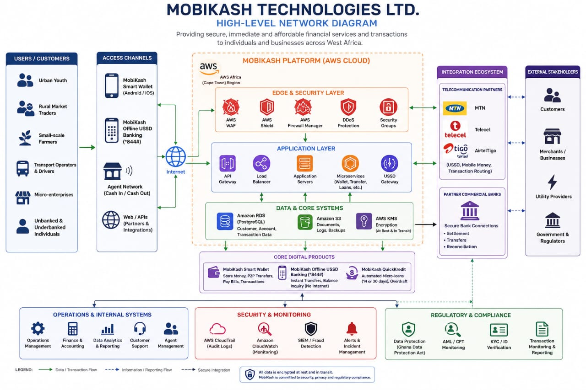

# MobiKash Technologies Ltd. — Threat Model Document

**Team:** Group 18 — Thrive Africa Cybersecurity Internship Program  
**Week:** 1  
**Methodology:** STRIDE

---

## Network Architecture

The platform runs entirely on AWS (Africa, Cape Town Region), with an edge/security layer (WAF, Shield, Firewall Manager, DDoS Protection, Security Groups), an application layer (API Gateway, Load Balancer, App Servers, Microservices, USSD Gateway), and a data layer (Amazon RDS/PostgreSQL, Amazon S3, AWS KMS). It integrates with telecom partners (MTN, Telecel, AirtelTigo) and partner commercial banks for settlement, transfers, and reconciliation.

---

## Entry Points & Attack Surfaces

An attack surface is every point where an unauthorized party could attempt to access, disrupt, or extract data from MobiKash's systems. Given its role as a financial services platform serving unbanked communities, the consequences of a breach extend beyond data loss — they directly threaten people's money and livelihoods.

### 1. Mobile Application (Smart Wallet — Android & iOS)
The Smart Wallet app is MobiKash's primary customer-facing surface. Attackers can exploit weak session management, insecure local data storage, or intercept API calls between the app and backend servers. Its direct access to user funds makes it a top-priority target for reverse engineering and credential harvesting.

### 2. USSD Gateway (*844#)
The USSD channel runs over MTN, Telecel, and AirtelTigo networks without end-to-end encryption. This exposes it to SIM swap attacks, session hijacking, and man-in-the-middle interception at the telecom layer. A successful attack here locks out offline users entirely — people with no other way to access their funds.

### 3. APIs & Third-Party Integrations
MobiKash's APIs connect it to partner banks, telecom providers, and payment processors. Poorly secured endpoints — missing authentication, no rate limiting, or weak input validation — open the door to unauthorized transactions, data exfiltration, and injection attacks. Third-party integrations also carry supply chain risk.

### 4. AWS Cloud Infrastructure
The entire platform runs on AWS (Africa, Cape Town Region). Misconfigured S3 buckets, overly permissive IAM roles, or exposed management consoles can give attackers cloud-level access — compromising the whole platform in one move.

### 5. PostgreSQL Database (Amazon RDS)
The centralized RDS database holds all customer, account, and transaction data. SQL injection through application-layer vulnerabilities, weak credentials, or excessive database privileges could expose or corrupt this critical data store.

### 6. Agent Network, QuickKredit & Overdraft
Cash deposit agents are human entry points — fraudulent or socially engineered agents can manipulate deposits and withdrawals. QuickKredit's automated lending and overdraft features, which rely on transaction history, can be abused through fabricated transaction patterns to fraudulently obtain loans or overdraft funds.

---

## STRIDE Threat Analysis

Using STRIDE, we map the specific threats relevant to MobiKash — who attacks, what they target, and how they do it.

| STRIDE | Threat Actor | Target | How They Attack |
|---|---|---|---|
| **Spoofing** | Cybercriminals, Fraudsters | Smart Wallet, employee accounts, USSD services | Vishing via fake MobiKash support lines; SIM swaps to hijack USSD sessions and drain wallets |
| **Tampering** | Hackers, Insider Threats | PostgreSQL DB, transaction records, account info | Intercepting app traffic to alter loan amounts; SQL injection to manipulate QuickKredit scoring or overdraft limits |
| **Repudiation** | Fraudulent users, Merchants | Transaction logs, audit records, system records | Merchants denying P2P receipts to demand double payment; agents claiming deposits were never made |
| **Information Disclosure** | External hackers, Competitors | Customer DB, account info, KYC records | Exploiting publicly exposed AWS S3 buckets containing unencrypted customer data or database backups |
| **Denial of Service** | Hacktivists, Competitors | Mobile app, USSD (*844#), APIs, cloud infra | Botnet flooding the *844# string with garbage requests, causing total blackout for offline users |
| **Elevation of Privilege** | Insider threats, APT groups | AWS environment, databases, admin accounts | IDOR exploitation or session token manipulation to gain admin access; abusing overly permissive IAM roles |

---

## Priority Mitigations

- Enforce **Multi-Factor Authentication (MFA)** on all user accounts and agent logins.
- Implement **cryptographic signing** on all API payloads with mandatory **TLS 1.3** encryption.
- Apply **least-privilege access (RBAC)** across all AWS IAM roles and admin panels.
- Implement **WORM (Write-Once, Read-Many) audit logging** for all transactions to prevent repudiation.
- Add **anomaly detection** on QuickKredit and overdraft flows to catch fraudulent loan or overdraft abuse early.
- Enforce **AES-256 encryption at rest** for all production databases and S3 cloud storage buckets.
- Deploy **API rate limiting and IP throttling** on the USSD gateway to prevent flooding attacks.

---

**Document:** Group18_Week1_ThreatModel.pdf  
**Role:** Threat Modeler (McJayy)  
**Team:** Group 18 — Thrive Africa Cybersecurity Internship Program
