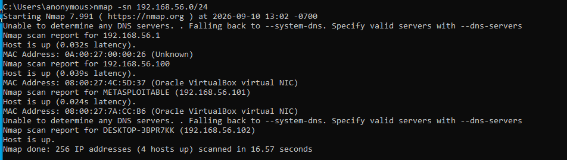
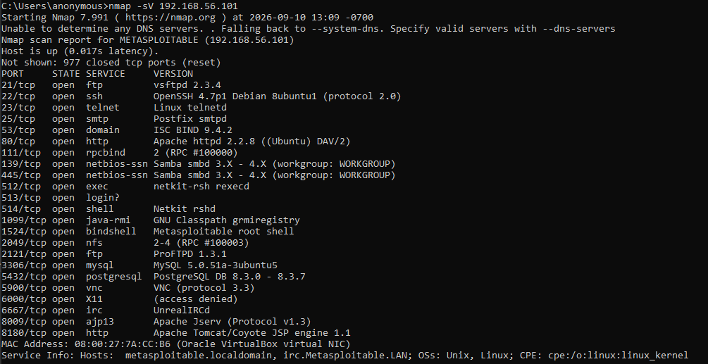
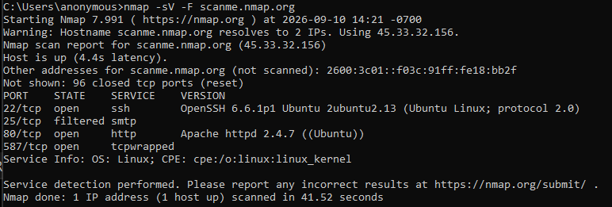
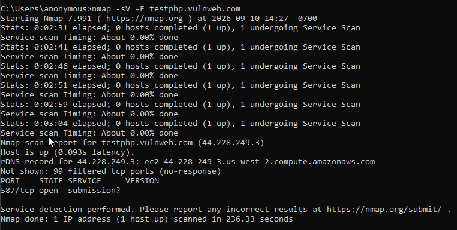

# Week 2 — Reconnaissance & Network Enumeration

**Group 18 · Thrive Africa Cybersecurity Internship · September 2026**

---

## Objective

The goal this week was to carry out reconnaissance and network enumeration on our assigned lab environment and the two external web targets we were given. In plain terms, we wanted to see what an attacker would see when first looking at these systems: which machines are alive, which ports are open, what services are running on them, and which of those services could be a way in.

### Scope
- **On-prem lab:** a Metasploitable 2 virtual machine (192.168.56.101), scanned from a Windows 10 VM (192.168.56.102) on a VirtualBox host-only network.
- **External web targets:** scanme.nmap.org and testphp.vulnweb.com, both public sites set up specifically for scan practice.

---

## Lab Setup

We ran both virtual machines in VirtualBox and put them on a host-only network so they could talk to each other without exposing anything to the wider internet. Metasploitable 2 was our target (a Linux box built to be deliberately insecure, default login `msfadmin/msfadmin`), and the Windows 10 VM was where we ran our scans, using Nmap 7.991 with Npcap installed.

Our first scans failed because the Windows VM was set to a NAT adapter, which puts each VM on its own separate network so the two could not reach each other. Once we switched it to a host-only adapter, both machines landed on the same `192.168.56.0/24` network and the Windows VM picked up the address `192.168.56.102`. Later, when we needed to scan the external sites, we added a second NAT adapter as well, so the host-only adapter kept talking to Metasploitable while the NAT adapter handled internet traffic.

---

## Host Discovery

We started with a simple ping sweep to find out which machines on the network were actually up before bothering to scan any of them in detail:

```
nmap -sn 192.168.56.0/24
```

The `-sn` flag tells Nmap to only check whether hosts are alive and skip port scanning for now — the network equivalent of walking down a street and noting which houses have someone home before deciding which doors to knock on.


*Figure 1: Ping sweep of the subnet, showing four live hosts.*

Four hosts came back as up:

| IP Address | Identity |
|---|---|
| 192.168.56.1 | Host machine's VirtualBox adapter |
| 192.168.56.100 | VirtualBox's internal DHCP server |
| 192.168.56.101 | Metasploitable 2 (our target) |
| 192.168.56.102 | Windows 10 VM (our scanning box) |

This confirmed Metasploitable was live and reachable, so it became the focus of the detailed scanning that followed.

---

## Ports & Services on Metasploitable

Next we scanned the target properly, asking Nmap to identify the version of each service it found:

```
nmap -sV 192.168.56.101
```

The `-sV` flag adds version detection. Instead of just telling us a port is open, it tries to name the exact software and version listening there — knowing something is "OpenSSH 4.7p1" rather than just "SSH" is what lets you check whether that specific version has known vulnerabilities.


*Figure 2: Version scan of Metasploitable, showing 20 open ports.*

The scan turned up 20 open ports. The main ones are listed below:

| Port | Service | Version |
|---|---|---|
| 21 | ftp | vsftpd 2.3.4 |
| 22 | ssh | OpenSSH 4.7p1 |
| 23 | telnet | Linux telnetd |
| 25 | smtp | Postfix |
| 53 | domain | ISC BIND 9.4.2 |
| 80 | http | Apache 2.2.8 |
| 139/445 | smb | Samba 3.x |
| 512–514 | rsh/rlogin | Netkit r-services |
| 1524 | bindshell | root shell |
| 2049 | nfs | NFS |
| 3306 | mysql | MySQL 5.0.51a |
| 5432 | postgresql | PostgreSQL 8.3 |
| 5900 | vnc | VNC 3.3 |
| 6667 | irc | UnrealIRCd |
| 8180 | http | Apache Tomcat/Coyote 1.1 |

Straight away a few of these stand out as trouble: outdated software (Apache 2.2.8, MySQL 5.0, PostgreSQL 8.3 are all long past end of life), unencrypted services that send everything in the clear (telnet and the r-services), and one port, 1524, that is simply an open root shell waiting for anyone to connect.

---

## External Web Targets

We were also asked to scan two public websites and include their results, so we treated them as part of the same recon exercise.

### scanme.nmap.org

A full scan of this host was extremely slow because the server rate-limits scan traffic, so we used fast mode to check the 100 most common ports instead:

```
nmap -sV -F scanme.nmap.org
```


*Figure 3: Fast version scan of scanme.nmap.org.*

This host keeps a small, tidy footprint: SSH on 22, a current version of Apache on 80, and little else. That is expected, since it is maintained by the Nmap team purely as a safe target to practise against.

### testphp.vulnweb.com

```
nmap -sV -F testphp.vulnweb.com
```


*Figure 4: Fast version scan of testphp.vulnweb.com.*

Here almost every port came back as "filtered," meaning our probes got no response at all rather than a clear open or closed. The site clearly works in a normal browser, so this is not a dead host. What it tells us is that there is a firewall or web application firewall in front of it, quietly dropping our scan packets — the target is actively defending against exactly the kind of reconnaissance we were doing.

Since the firewall blocked direct fingerprinting, we confirmed the site's technology from its public documentation. It runs Apache, PHP and MySQL, and it is a known Acunetix training site that intentionally contains web flaws such as SQL injection and cross-site scripting. Those live at the web-application layer, which is a topic for a later week rather than this network-level scan.

---

## Exposed & Vulnerable Services

Matching the versions we found against public vulnerability records, several of the services on Metasploitable have serious, well-documented problems. Severity reflects published CVSS ratings where available. A dense list like this is expected, since Metasploitable is built to be vulnerable; the point of the exercise is showing how you get from a service version to a real, named weakness.

| Service | CVE / Issue | Severity | Why it matters |
|---|---|---|---|
| vsftpd 2.3.4 | CVE-2011-2523 | Critical | This build shipped with a backdoor. A crafted login opens a root shell, giving full control of the machine. |
| Samba 3.x | CVE-2007-2447 | Critical | A flaw in username handling lets an attacker run commands as root over SMB. |
| UnrealIRCd | CVE-2010-2075 | Critical | This copy of the IRC server was trojaned and lets a remote attacker run any command. |
| Open bindshell (1524) | No auth | Critical | A root shell is already listening on this port. No exploit needed, just connect. |
| Telnet, rsh/rlogin | Plaintext | High | These send passwords and data with no encryption, so anyone on the network can read them. |
| Apache 2.2.8 / MySQL 5.0 / PostgreSQL 8.3 | End of life | High | All are years out of support with many known bugs and no more security patches. |
| VNC (5900) | Weak auth | High | Remote desktop access that is usually left on a weak or default password on this box. |
| NFS (2049) | Misconfig | Medium | Often shares files with no authentication, exposing the filesystem. |

The two web targets were a different story. Neither showed an obvious network-level weakness: scanme.nmap.org runs a clean, minimal setup, and testphp.vulnweb.com sits behind a firewall that blocked our scans outright.

---

## Attack Surface Summary

Putting it all together, the contrast is striking. The internal Metasploitable host is wide open, with 20 ports exposed and several of them handing over root access with little or no effort (the vsftpd backdoor, the Samba and UnrealIRCd flaws, and the open shell on 1524). Any one of those alone would be enough for an attacker to take the machine and use it as a foothold into the rest of the network.

The external websites, by comparison, were the harder targets. One exposed almost nothing, and the other actively filtered our traffic. The lesson here is a common one in real environments: the biggest danger is often not the public website everyone watches, but a forgotten, unpatched internal machine that no one is maintaining.

### What we would recommend

- Patch or retire the Metasploitable-style host, and turn off the plaintext services (telnet, rsh, rlogin) in favour of SSH.
- Close the open shell on port 1524 and remove the backdoored vsftpd and UnrealIRCd builds.
- Upgrade or isolate the end-of-life web and database software.
- Put strong passwords on VNC and lock down the NFS shares.

---

## Tools Used

- **Nmap 7.991** with Npcap, for scanning and version detection.
- **Oracle VirtualBox**, for the lab (host-only plus NAT adapters).
- **Public CVE databases**, for checking the versions we found against known vulnerabilities.

---

**Source:** Group18_Week2.docx  
**Team:** Group 18 — Thrive Africa Cybersecurity Internship Program
